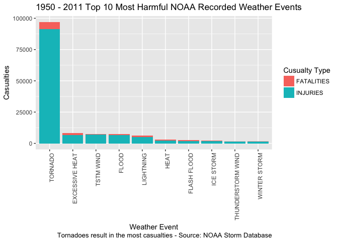
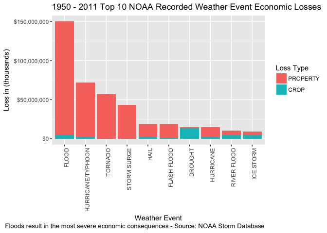

## NOAA Storm Data Analysis

```r
require("knitr")
```

```
## Loading required package: knitr
```

```r
knitr::opts_chunk$set(echo = TRUE)
opts_knit$set(root.dir = "~/Documents/Data Science/Reproducible Research/Week 4")
```

### 1. Synopsis

Storms and other severe weather events can cause both public health and economic problems for communities and municipalities. Many severe events can result in fatalities, injuries, and property damage, and preventing such outcomes to the extent possible is a key concern.

This project involves exploring the U.S. National Oceanic and Atmospheric Administration's (NOAA) storm database. This database tracks characteristics of major storms and weather events in the United States, including when and where they occur, as well as estimates of any fatalities, injuries, and property damage.


Load Libraries

```r
library(ggplot2)
library(dplyr)
```

```
## 
## Attaching package: 'dplyr'
```

```
## The following objects are masked from 'package:stats':
## 
##     filter, lag
```

```
## The following objects are masked from 'package:base':
## 
##     intersect, setdiff, setequal, union
```

```r
library(reshape2)
library(plyr)
```

```
## -------------------------------------------------------------------------
```

```
## You have loaded plyr after dplyr - this is likely to cause problems.
## If you need functions from both plyr and dplyr, please load plyr first, then dplyr:
## library(plyr); library(dplyr)
```

```
## -------------------------------------------------------------------------
```

```
## 
## Attaching package: 'plyr'
```

```
## The following objects are masked from 'package:dplyr':
## 
##     arrange, count, desc, failwith, id, mutate, rename, summarise,
##     summarize
```

### 2. Data Processing

```r
## Setup working directory
setwd("~/Documents/Data Science/Reproducible Research/Week 4")

## File Download
## Assign the file link/ location to fileUrl.
fileUrl <- "https://d396qusza40orc.cloudfront.net/repdata%2Fdata%2FStormData.csv.bz2"
## Download the file
download.file(fileUrl, destfile="./Dataset.zip", method="curl")

## Table load
StormData <-read.csv("Dataset.zip", header=TRUE, sep=",", na.strings = "NA")
```

### 2.1.1 System Information

```r
Sys.info()
```

```
##                                                                                           sysname 
##                                                                                          "Darwin" 
##                                                                                           release 
##                                                                                          "15.6.0" 
##                                                                                           version 
## "Darwin Kernel Version 15.6.0: Tue Jan  9 20:12:05 PST 2018; root:xnu-3248.73.5~1/RELEASE_X86_64" 
##                                                                                          nodename 
##                                                                 "Joses-MBP.championbroadband.com" 
##                                                                                           machine 
##                                                                                          "x86_64" 
##                                                                                             login 
##                                                                                          "josepi" 
##                                                                                              user 
##                                                                                          "josepi" 
##                                                                                    effective_user 
##                                                                                          "josepi"
```

### 2.1 Structure of Storm Data File

```r
str(StormData)
```

```
## 'data.frame':	902297 obs. of  37 variables:
##  $ STATE__   : num  1 1 1 1 1 1 1 1 1 1 ...
##  $ BGN_DATE  : Factor w/ 16335 levels "1/1/1966 0:00:00",..: 6523 6523 4242 11116 2224 2224 2260 383 3980 3980 ...
##  $ BGN_TIME  : Factor w/ 3608 levels "00:00:00 AM",..: 272 287 2705 1683 2584 3186 242 1683 3186 3186 ...
##  $ TIME_ZONE : Factor w/ 22 levels "ADT","AKS","AST",..: 7 7 7 7 7 7 7 7 7 7 ...
##  $ COUNTY    : num  97 3 57 89 43 77 9 123 125 57 ...
##  $ COUNTYNAME: Factor w/ 29601 levels "","5NM E OF MACKINAC BRIDGE TO PRESQUE ISLE LT MI",..: 13513 1873 4598 10592 4372 10094 1973 23873 24418 4598 ...
##  $ STATE     : Factor w/ 72 levels "AK","AL","AM",..: 2 2 2 2 2 2 2 2 2 2 ...
##  $ EVTYPE    : Factor w/ 985 levels "   HIGH SURF ADVISORY",..: 834 834 834 834 834 834 834 834 834 834 ...
##  $ BGN_RANGE : num  0 0 0 0 0 0 0 0 0 0 ...
##  $ BGN_AZI   : Factor w/ 35 levels "","  N"," NW",..: 1 1 1 1 1 1 1 1 1 1 ...
##  $ BGN_LOCATI: Factor w/ 54429 levels ""," Christiansburg",..: 1 1 1 1 1 1 1 1 1 1 ...
##  $ END_DATE  : Factor w/ 6663 levels "","1/1/1993 0:00:00",..: 1 1 1 1 1 1 1 1 1 1 ...
##  $ END_TIME  : Factor w/ 3647 levels ""," 0900CST",..: 1 1 1 1 1 1 1 1 1 1 ...
##  $ COUNTY_END: num  0 0 0 0 0 0 0 0 0 0 ...
##  $ COUNTYENDN: logi  NA NA NA NA NA NA ...
##  $ END_RANGE : num  0 0 0 0 0 0 0 0 0 0 ...
##  $ END_AZI   : Factor w/ 24 levels "","E","ENE","ESE",..: 1 1 1 1 1 1 1 1 1 1 ...
##  $ END_LOCATI: Factor w/ 34506 levels ""," CANTON"," TULIA",..: 1 1 1 1 1 1 1 1 1 1 ...
##  $ LENGTH    : num  14 2 0.1 0 0 1.5 1.5 0 3.3 2.3 ...
##  $ WIDTH     : num  100 150 123 100 150 177 33 33 100 100 ...
##  $ F         : int  3 2 2 2 2 2 2 1 3 3 ...
##  $ MAG       : num  0 0 0 0 0 0 0 0 0 0 ...
##  $ FATALITIES: num  0 0 0 0 0 0 0 0 1 0 ...
##  $ INJURIES  : num  15 0 2 2 2 6 1 0 14 0 ...
##  $ PROPDMG   : num  25 2.5 25 2.5 2.5 2.5 2.5 2.5 25 25 ...
##  $ PROPDMGEXP: Factor w/ 19 levels "","-","?","+",..: 17 17 17 17 17 17 17 17 17 17 ...
##  $ CROPDMG   : num  0 0 0 0 0 0 0 0 0 0 ...
##  $ CROPDMGEXP: Factor w/ 9 levels "","?","0","2",..: 1 1 1 1 1 1 1 1 1 1 ...
##  $ WFO       : Factor w/ 542 levels ""," CI","%SD",..: 1 1 1 1 1 1 1 1 1 1 ...
##  $ STATEOFFIC: Factor w/ 250 levels "","ALABAMA, Central",..: 1 1 1 1 1 1 1 1 1 1 ...
##  $ ZONENAMES : Factor w/ 25112 levels "","                                                                                                               "| __truncated__,..: 1 1 1 1 1 1 1 1 1 1 ...
##  $ LATITUDE  : num  3040 3042 3340 3458 3412 ...
##  $ LONGITUDE : num  8812 8755 8742 8626 8642 ...
##  $ LATITUDE_E: num  3051 0 0 0 0 ...
##  $ LONGITUDE_: num  8806 0 0 0 0 ...
##  $ REMARKS   : Factor w/ 436781 levels "","\t","\t\t",..: 1 1 1 1 1 1 1 1 1 1 ...
##  $ REFNUM    : num  1 2 3 4 5 6 7 8 9 10 ...
```


### 2.2 Subset data

```r
# To improve processing time eliminate extra columns and data
# Select the desired columns
StormDataSet <- select(StormData, EVTYPE, FATALITIES, INJURIES, PROPDMG, PROPDMGEXP, CROPDMG, CROPDMGEXP)
# Select the rows with relevant data or > 0 data
StormDataSet <- subset(StormDataSet, EVTYPE != "?" & INJURIES > 0 | FATALITIES > 0 | PROPDMG > 0 | CROPDMG > 0)
```


### 2.3 Transform the data

```r
## Property Damage Exponent
# Convert all alphanumeric exponents to uppercase
StormDataSet$PROPDMGEXP <- toupper(StormDataSet$PROPDMGEXP)
# Assign multiplier to alphanumeric exponents
PROPDMGEXPMULT <-  c("\"\"" = 10^0,
                     "-" = 10^0, 
                     "+" = 10^0,
                     "0" = 10^0,
                     "1" = 10^1,
                     "2" = 10^2,
                     "3" = 10^3,
                     "4" = 10^4,
                     "5" = 10^5,
                     "6" = 10^6,
                     "7" = 10^7,
                     "8" = 10^8,
                     "9" = 10^9,
                     "H" = 10^2,
                     "K" = 10^3,
                     "M" = 10^6,
                     "B" = 10^9)
# Replace the alpanumeric exponent with the multiplier
StormDataSet$PROPDMGEXP <- PROPDMGEXPMULT[as.character(StormDataSet$PROPDMGEXP)]
StormDataSet$PROPDMGEXP[is.na(StormDataSet$PROPDMGEXP)] <- 10^0

## Crop Damage Exponent
# Convert all alphanumeric exponents to uppercase
StormDataSet$CROPDMGEXP <- toupper(StormDataSet$CROPDMGEXP)
# Assign multiplier to alphanumeric exponents
CROPDMGEXPMULT <-  c("\"\"" = 10^0,
                     "?" = 10^0, 
                     "0" = 10^0,
                     "K" = 10^3,
                     "M" = 10^6,
                     "B" = 10^9)
# Replace the alpanumeric exponent with the multiplier
StormDataSet$CROPDMGEXP <- CROPDMGEXPMULT[as.character(StormDataSet$CROPDMGEXP)]
StormDataSet$CROPDMGEXP[is.na(StormDataSet$CROPDMGEXP)] <- 10^0

## Uppercase all Event Types for uniformity
StormDataSet$EVTYPE <- toupper(StormDataSet$EVTYPE)
```


### 2.4 Population Health Storm Data Processing

```r
# Aggregate the fatalities and injuries by event type
HealthStormData <- aggregate(cbind(StormDataSet$FATALITIES, StormDataSet$INJURIES) ~ StormDataSet$EVTYPE, data=StormDataSet, FUN=sum)
# Add a total column for casualties
HealthStormData$TOTALCASUALTIES <- HealthStormData$V1 + HealthStormData$V2
# Rename the columns
names(HealthStormData) <- c("EVENT_TYPE", "FATALITIES", "INJURIES", "TOTAL")
# Sort Descending by total
HealthStormData <- arrange(HealthStormData, desc(TOTAL))
# Select the top 10 records
HealthStormData <- head(HealthStormData,10)
# Subset the data without total
HealthStormTest <- select(HealthStormData,EVENT_TYPE, FATALITIES, INJURIES)
# Melt the data for Event Types and Casualties
HealthStormTest <- melt(HealthStormTest)
```

```
## Using EVENT_TYPE as id variables
```

```r
# Fix column names
names(HealthStormTest) <- c("EVENT_TYPE", "CASUALTY_TYPE", "CASUALTY_COUNT")
```

### 2.5 Economic Storm Data Processing

```r
# Determine total property loss using multiplier
StormDataSet$PropertyDamage <- StormDataSet$PROPDMG * StormDataSet$PROPDMGEXP
# Determine total crop loss using multiplier
StormDataSet$CropDamage <- StormDataSet$CROPDMG * StormDataSet$CROPDMGEXP
# Aggregate the data
EconomicStormData <- aggregate(cbind(PropertyDamage, CropDamage) ~ EVTYPE, data=StormDataSet, FUN=sum)
# Add a total column for casualties
EconomicStormData$TOTALDAMAGE <- EconomicStormData$PropertyDamage + EconomicStormData$CropDamage
# Format total to remove scientific exponential notation
EconomicStormData$TOTALDAMAGE <- format(EconomicStormData$TOTALDAMAGE, scientific = F)
# Rename the columns
names(EconomicStormData) <- c("EVENT_TYPE", "PROPERTY", "CROP", "TOTAL")
# Sort Descending by total
EconomicStormData <- arrange(EconomicStormData, desc(TOTAL))
# Select the top 10 records
EconomicStormData <- head(EconomicStormData,10)
# Subset the data without total
EconomicStormTest <- select(EconomicStormData,EVENT_TYPE, PROPERTY, CROP)
# Melt the data for Event Types and Casualties
EconomicStormTest <- melt(EconomicStormTest)
```

```
## Using EVENT_TYPE as id variables
```

```r
# Fix column names
names(EconomicStormTest) <- c("EVENT_TYPE", "LOSS_TYPE", "TOTAL_LOSS")
# Convert Totals to "Thousands"
EconomicStormTest$TOTAL_LOSS <- EconomicStormTest$TOTAL_LOSS / 1000
```


### 3. Results

### 3.1 Across the United States, which types of events (as indicated in the EVTYPE variable) are most harmful with respect to population health?

```r
p4 <- ggplot() + geom_bar(aes(x=reorder(EVENT_TYPE, -CASUALTY_COUNT), y=CASUALTY_COUNT, fill = CASUALTY_TYPE), 
        data = HealthStormTest,
        stat="identity") 
p4 <- p4 + geom_text(data=HealthStormTest, aes(x = EVENT_TYPE, y = CASUALTY_COUNT,
        label = ""), 
        size=3) +
        theme(axis.text.x = element_text(angle = 90, hjust = 1)) +
        labs(x = "Weather Event", y = "Casualties",
        caption = "Tornadoes result in the most casualties - Source: NOAA Storm Database") +
        ggtitle("1950 - 2011 Top 10 Most Harmful NOAA Recorded Weather Events")
p4 <- p4 + guides(fill=guide_legend(title="Cusualty Type"))
p4
```

<!-- -->

### 3.2 Across the United States, which types of events have the greatest economic consequences?

```r
p4 <- ggplot() + geom_bar(aes(x=reorder(EVENT_TYPE, -TOTAL_LOSS), y=TOTAL_LOSS, fill = LOSS_TYPE), 
        data = EconomicStormTest,
        stat="identity") 
p4 <- p4 + geom_text(data=EconomicStormTest, aes(x = EVENT_TYPE, y = TOTAL_LOSS,
        label = ""), 
        size=3) +
        scale_y_continuous(labels = scales::dollar) +
        theme(axis.text.x = element_text(angle = 90, hjust = 1)) +
        labs(x = "Weather Event", y = "Loss in (thousands)", 
        caption = "Floods result in the most severe economic consequences - Source: NOAA Storm Database") +
        ggtitle("1950 - 2011 Top 10 NOAA Recorded Weather Event Economic Losses")
p4 <- p4 + guides(fill=guide_legend(title="Loss Type"))
p4
```

<!-- -->


### 4. Summary

### 4.1 Across the United States, which types of events (as indicated in the EVTYPE variable) are most harmful with respect to population health?
As observed in the "1950 - 2011 Top 10 Most Harmful NOAA Recorded Weather Events" chart, tornadoes account by far, for the most injuries and fatalities over all categories recorded, since 1950.

### 4.2 Across the United States, which types of events have the greatest economic consequences?
As observed in the "1950 - 2011 Top 10 NOAA Recorded Weather Event Economic Losses" chart, floods cause the most property loss and economic impact over all categories recorded, since 1950.
